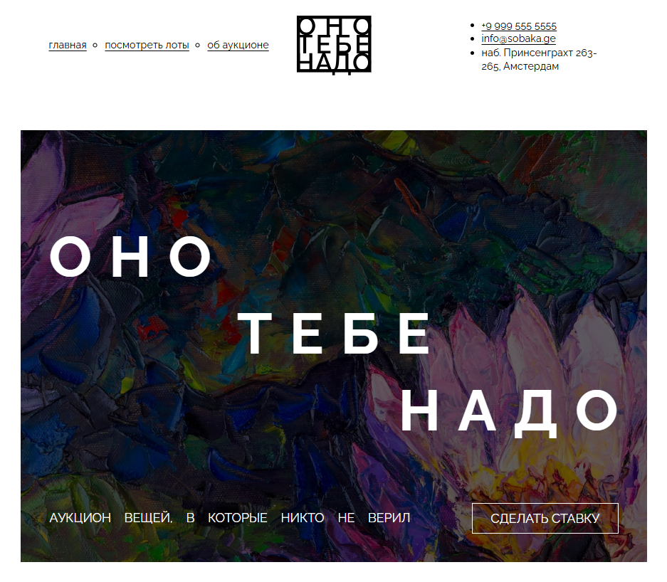
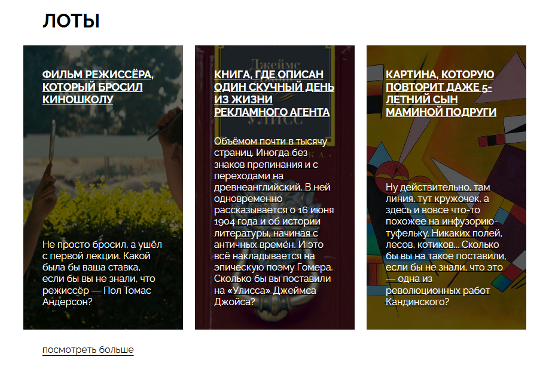
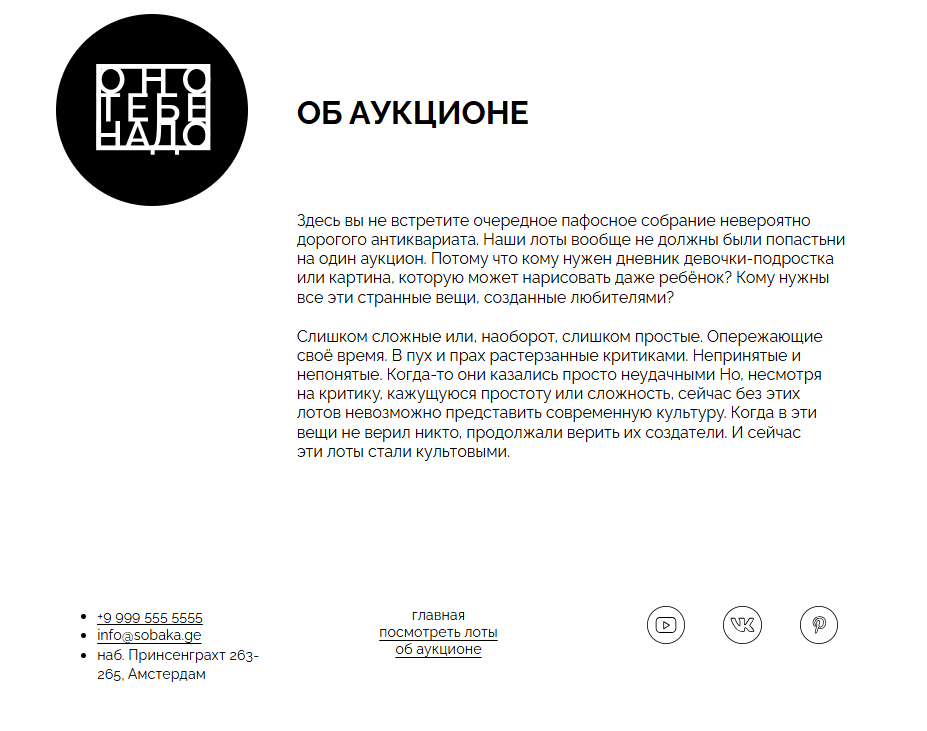

https://github.com/NikitosII/ono-tebe-nado-ad.git

# Оно тебе надо

Учебный проект — вёрстка лендинга аукциона вещей.

## Структура проекта

```
├── index.html          — разметка страницы
├── styles/
│   ├── global.css      — сброс браузерных стилей и базовые настройки
│   └── style.css       — стили проекта
├── fonts/
│   ├── fonts.css       — подключение шрифтов
│   ├── Raleway-Regular.woff2 / .woff
│   └── Raleway-Bold.woff2 / .woff
└── images/             — изображения для контента и оформления
```

## Технологии

- Семантическая HTML-разметка (`header`, `main`, `footer`, `nav`, `address`, `article`)
- CSS Grid — шапка (три колонки: меню / логотип / адрес), секция «Об аукционе», подвал
- Flexbox — список карточек, меню, футер-навигация, иконки соцсетей
- Абсолютно спозиционированный полупрозрачный оверлей поверх фоновых изображений
- Шрифт Raleway через `@font-face`

## Результат






